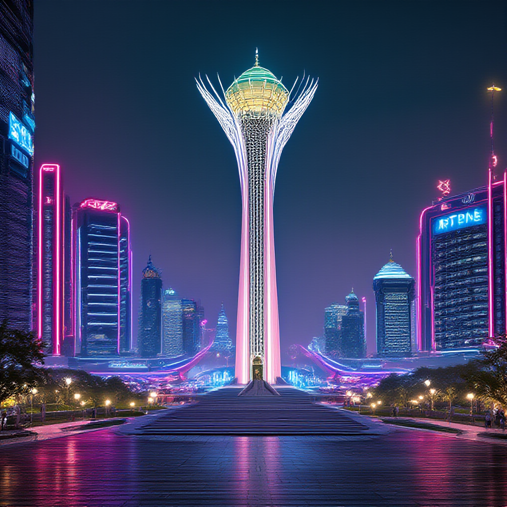

# ISSAI Playground: Personal AI Assistants & Voice Service Integration

ISSAI Playground is a Python-based framework that integrates Oylan 2 API, MangiSoz (SoyleTTS, SoyleSTT), Beynele Text-to-Image, and other services. With this platform, you can easily build Telegram bots, voice assistants, and multimodal AI solutions.

> **Note:** This project is based on the repository [oylan-assistant](https://github.com/dauitsuragan002/oylan-assistant).

## Quick Start

### Requirements

- Python 3.9+
- Install required packages:

```bash
pip install -r requirements.txt
```

### Setup & Configuration

1. Create a `.env` file and add your API keys:

```env
TOKEN=<Telegram Bot Token>
API_RESPONSE=<Oylan API Key>
API_SOYLE=<Soyle API Key>
API_MAIN_SOYLE=<accessToken>
API_MAIN_BEYNELE=<accessToken>
```

> **How to get `accessToken`:**
> 1. Go to https://mangisoz.nu.edu.kz/soyle or https://beynele.nu.edu.kz/beynele
> 2. Press F12 → Application → Cookies → Copy the value of `accessToken`

2. Configure your assistant in `config.py`:

```python
ASSISTANT_ID = 'your_assistant_id'
```

## Examples & Usage

- **Assistant creation, update, info:**
  - `oylan/assistant/create.py`
  - `oylan/assistant/update.py`
  - `oylan/assistant/get_info.py`
  - `oylan/assistant/models_list.py` — list available models

- **Context management:**
  - `oylan/contexts/add_context.py` — add context
  - `oylan/contexts/get_context.py` — get context info
  - `oylan/contexts/delete_context.py` — delete context

- **Voice processing:**
  - `soyle/auto_detected.py` — language detection (langid)
  - `soyle/transcription.py` — speech-to-text

- **Soyle TTS:**
-----
<table>
<tr>
<td align="center">
    
**Example 1**
</td>
<td align="center">
    
**Example 2**
</td>
</tr>

<tr>
<td align="center">

[soyle tts](https://github.com/user-attachments/assets/1d3aaaeb-d95c-4ed9-9738-399fa6d4ca05)

</td>
<td align="center">
  
[input_audio.webm](https://github.com/user-attachments/assets/74ef22dd-fe90-4e1d-8ec1-71faee52d804)

</td>
</tr>
</table>


  - `soyle/tts.py` — text-to-speech

- **Image generation:**

  - `beynele/beynele.py` — text-to-image

## Contact

- https://t.me/david667s
- https://t.me/davidsuragan

## License

MIT License
